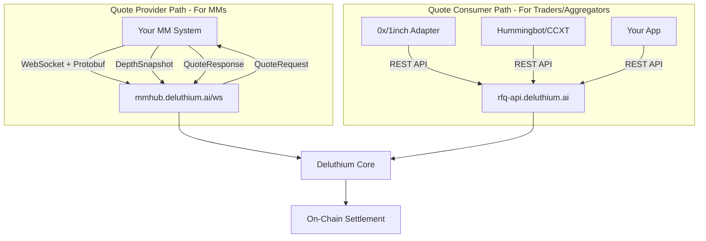
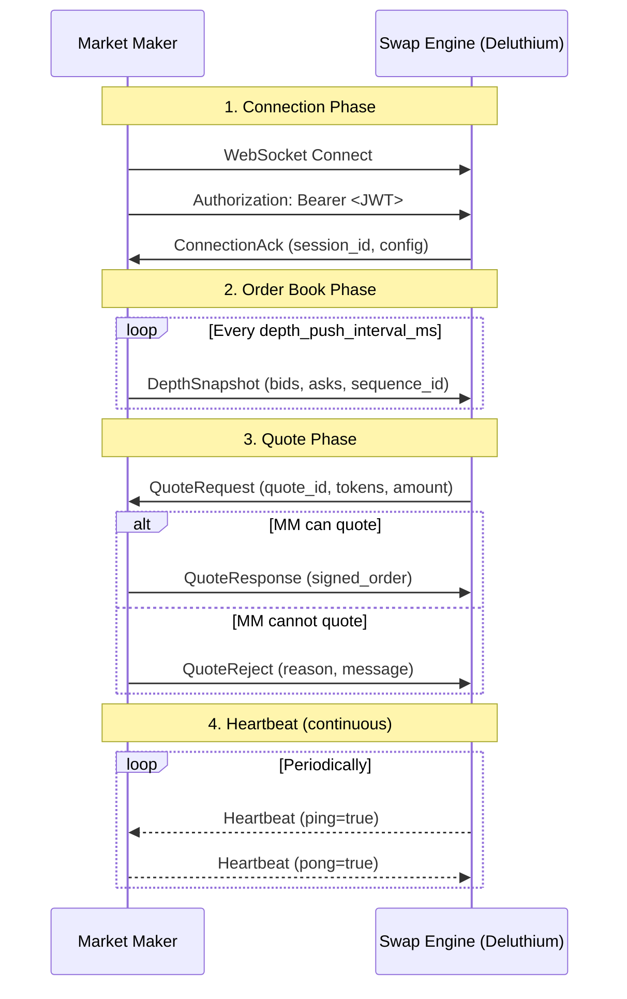

# Deluthium Market Maker Onboarding Guide

> **Version**: 1.0  
> **Last Updated**: 2026-02-04  
> **Audience**: Professional Market Makers integrating with Deluthium DEX

---

## Table of Contents

1. [Platform Overview](#1-platform-overview)
2. [Prerequisites Checklist](#2-prerequisites-checklist)
3. [WebSocket Integration Deep Dive](#3-websocket-integration-deep-dive)
4. [EIP-712 Signing Guide](#4-eip-712-signing-guide)
5. [Native Token Handling](#5-native-token-handling)
6. [Production Patterns](#6-production-patterns)
7. [API Quick Reference](#7-api-quick-reference)
8. [Field Mapping Reference](#8-field-mapping-reference)
9. [Related Integrations](#9-related-integrations)
10. [Troubleshooting and FAQ](#10-troubleshooting-and-faq)

---

## 1. Platform Overview

### What is Deluthium?

Deluthium (also known as DarkPool) is a **Request-for-Quote (RFQ) based decentralized exchange** that sources liquidity from professional market makers. Unlike AMM-based DEXes, Deluthium enables MMs to provide competitive quotes with tighter spreads and deeper liquidity.

### Integration Paths

There are two primary ways to integrate with Deluthium:



| Path | Protocol | Use Case | Reference Implementation |
|------|----------|----------|--------------------------|
| **Quote Provider** | WebSocket + Protobuf | MMs pushing order books and responding to quote requests | [DarkPool-Market-Maker-Example](https://github.com/thetafunction/DarkPool-Market-Maker-Example) (Go) |
| **Quote Consumer** | REST API | Getting quotes and executing swaps | [0x-deluthium-adapter](https://github.com/thetafunction/0x-deluthium-adapter), [1inch-deluthium-adapter](https://github.com/thetafunction/1inch-deluthium-adapter) |

### Supported Chains

| Chain | Chain ID | RFQ Manager | Router | Wrapped Native Token |
|-------|----------|-------------|--------|----------------------|
| **BSC Mainnet** | 56 | `0x94020Af3571f253754e5566710A89666d90Df615` | `0xaAeD8af417B4bF80802fD1B0ccd44d8E15ba33Ff` | WBNB: `0xbb4CdB9CBd36B01bD1cBaEBF2De08d9173bc095c` |
| **Base Mainnet** | 8453 | `0x7648CE928efa92372E2bb34086421a8a1702bD36` | `0xcd3cA39373A21EDF2d7E68C6596678525447Eb82` | WETH: `0x4200000000000000000000000000000000000006` |
| **Ethereum Mainnet** | 1 | TBD | TBD | WETH: `0xC02aaA39b223FE8D0A0e5C4F27eAD9083C756Cc2` |

### Service Endpoints

| Service | URL | Purpose |
|---------|-----|---------|
| **WebSocket Hub** | `wss://mmhub.deluthium.ai/ws` | MM quote provider connection |
| **REST API** | `https://rfq-api.deluthium.ai` | Quote consumer API |
| **Product Frontend** | `https://deluthium.ai/en/swap-plus` | End-user trading interface |

---

## 2. Prerequisites Checklist

Before integrating as a Market Maker, complete these steps:

### 2.1 Signer Account Configuration

1. **Prepare a Signer Account**: Create or designate an Ethereum-compatible account for signing quotes
2. **Submit to Deluthium Team**: Provide your signer account address to the Deluthium team
3. **Receive JWT Token**: You'll receive a Bearer Token (JWT) for WebSocket authentication

> **Security Note**: The `mm_id` in your JWT must match your signer address.

### 2.2 Deploy MMVault Contract

Deploy the `MMVaultExample` contract to hold your market-making funds.

**Deployment Command (using Foundry):**

```bash
forge create src/MMVaultExample.sol:MMVaultExample \
  --rpc-url $RPC_URL \
  --private-key $DEPLOYER_PRIVATE_KEY \
  --constructor-args <WETH9_ADDRESS>
```

**Constructor Parameters:**

| Chain | WETH9 Address |
|-------|---------------|
| BSC Mainnet | `0xbb4CdB9CBd36B01bD1cBaEBF2De08d9173bc095c` |
| BSC Testnet | `0xae13d989daC2f0dEbFf460aC112a837C89BAa7cd` |
| Base Mainnet | `0x4200000000000000000000000000000000000006` |

**Post-Deployment Configuration:**

After deployment, configure your Vault to recognize DarkPool contracts:

```solidity
// 1. Set RFQ Manager Address
vault.setRFQManager(0x94020Af3571f253754e5566710A89666d90Df615); // BSC
// or
vault.setRFQManager(0x7648CE928efa92372E2bb34086421a8a1702bD36); // Base

// 2. Set Router Address
vault.setRouter(0xaAeD8af417B4bF80802fD1B0ccd44d8E15ba33Ff); // BSC
// or
vault.setRouter(0xcd3cA39373A21EDF2d7E68C6596678525447Eb82); // Base
```

### 2.3 Fund Your Vault

**Depositing Funds:**

| Token Type | Method |
|------------|--------|
| **Native Token (ETH/BNB)** | Send directly to contract address; automatically wrapped to WETH/WBNB |
| **ERC20 Tokens** | Use standard `transfer()` to send tokens to contract address |

**Withdrawing Funds (Owner Only):**

```solidity
// Withdraw ERC20
vault.withdrawERC20(tokenAddress, recipientAddress, amount);

// Withdraw Native Token (unwraps WETH first)
vault.withdrawNative(recipientAddress, amount);
```

### 2.4 Obtain JWT Token

Contact the Deluthium team to:
1. Register your MM account
2. Receive your JWT token for API authentication
3. Configure your trading pairs and limits

---

## 3. WebSocket Integration Deep Dive

### Connection Flow



### Message Types Reference

All messages use Protobuf encoding with `mm.v1.Message` as the unified wrapper.

| Message Type | Direction | Description |
|--------------|-----------|-------------|
| `MESSAGE_TYPE_CONNECTION_ACK` | SE → MM | Connection confirmation with session config |
| `MESSAGE_TYPE_DEPTH_SNAPSHOT` | MM → SE | Full order book snapshot |
| `MESSAGE_TYPE_QUOTE_REQUEST` | SE → MM | Request for firm quote |
| `MESSAGE_TYPE_QUOTE_RESPONSE` | MM → SE | Signed quote response |
| `MESSAGE_TYPE_QUOTE_REJECT` | MM → SE | Quote rejection with reason |
| `MESSAGE_TYPE_HEARTBEAT` | Bidirectional | Keep-alive ping/pong |
| `MESSAGE_TYPE_ERROR` | Bidirectional | Error notification |

### Connection Authentication

```go
// Go Example
headers := http.Header{}
headers.Add("Authorization", "Bearer "+jwtToken)

conn, _, err := websocket.DefaultDialer.Dial(
    "wss://mmhub.deluthium.ai/ws",
    headers,
)
```

```typescript
// TypeScript Example
const ws = new WebSocket("wss://mmhub.deluthium.ai/ws", {
  headers: {
    "Authorization": `Bearer ${jwtToken}`
  }
});
```

### ConnectionAck Handling

Upon successful connection, you'll receive a `ConnectionAck` message:

```protobuf
message ConnectionAck {
  bool success = 1;
  string session_id = 2;
  string mm_address = 3;
  string error_message = 4;
  ConnectionConfig config = 5;
}

message ConnectionConfig {
  int64 depth_push_interval_ms = 1;   // Recommended push interval
  int64 quote_timeout_ms = 2;          // Max time to respond to quotes
  int64 heartbeat_interval_ms = 3;     // Heartbeat frequency
}
```

**Handling Logic:**
- If `success=false`: Log `error_message`, disconnect, and retry with backoff
- If `success=true`: Save `session_id`, read config parameters, start depth pushing

### DepthSnapshot Format

```protobuf
message DepthSnapshot {
  uint64 chain_id = 1;
  string pair_id = 2;           // e.g., "WBNB-USDC"
  string token_a = 3;           // Base token (MUST be wrapped token address)
  string token_b = 4;           // Quote token
  repeated PriceLevel bids = 5; // Sorted by price DESCENDING
  repeated PriceLevel asks = 6; // Sorted by price ASCENDING
  uint64 sequence_id = 7;       // Monotonically increasing
  int64 timestamp = 8;
}

message PriceLevel {
  string price = 1;   // tokenB/tokenA ratio (string for precision)
  string amount = 2;  // tokenA quantity in wei (string integer)
}
```

**Critical Requirements:**
- Push **full snapshots** (not deltas) at `depth_push_interval_ms` intervals
- Use **Wrapped Token addresses** (WBNB, WETH), never zero address
- Sort bids **descending** by price, asks **ascending** by price
- Increment `sequence_id` monotonically for debugging

### QuoteRequest Handling

```protobuf
message QuoteRequest {
  string quote_id = 1;      // MUST use this in response
  uint64 chain_id = 2;
  string mm_id = 3;
  string token_in = 4;      // May be zero address for native token
  string token_out = 5;     // May be zero address for native token
  string amount_in = 6;     // Wei amount (string)
  string recipient = 7;     // User's receiving address
  string nonce = 8;         // Anti-replay
  int64 deadline = 9;       // Unix seconds
  uint32 slippage_bps = 10; // Basis points (1 bps = 0.01%)
}
```

### QuoteResponse Format

```protobuf
message QuoteResponse {
  string quote_id = 1;           // Echo from request
  QuoteStatus status = 2;        // QUOTE_STATUS_SUCCESS
  SignedOrder order = 3;
}

message SignedOrder {
  string signer = 1;             // Your signer address
  string manager = 2;            // RFQ Manager contract
  string from = 3;               // User's from address
  string to = 4;                 // User's to address
  string input_token = 5;        // Keep original (may be zero)
  string output_token = 6;       // Keep original (may be zero)
  string amount_in = 7;          // Wei string
  string amount_out = 8;         // Wei string (your quote)
  int64 deadline = 9;
  string nonce = 10;
  string extra_data = 11;        // ABI encoded data
  string signature = 12;         // EIP-712 signature (65 bytes)
}
```

### QuoteReject Reasons

```protobuf
enum RejectReason {
  REJECT_REASON_UNSPECIFIED = 0;
  REJECT_REASON_INSUFFICIENT_LIQUIDITY = 1;
  REJECT_REASON_PRICE_MOVED = 2;
  REJECT_REASON_UNSUPPORTED_PAIR = 3;
  REJECT_REASON_RATE_LIMITED = 4;
  REJECT_REASON_INTERNAL_ERROR = 5;
}
```

---

## 4. EIP-712 Signing Guide

Deluthium uses EIP-712 typed data signatures for quote verification.

### Domain Separator

```go
// Go
domain := apitypes.TypedDataDomain{
    Name:              "DarkPool Pool",
    Version:           "1",
    ChainId:           math.NewHexOrDecimal256(int64(chainID)),
    VerifyingContract: rfqManagerAddress,
}
```

```typescript
// TypeScript
const domain = {
    name: "DarkPool Pool",
    version: "1",
    chainId: chainId,
    verifyingContract: rfqManagerAddress,
};
```

### MMQuote Type Definition

```go
// Go
types := apitypes.Types{
    "EIP712Domain": []apitypes.Type{
        {Name: "name", Type: "string"},
        {Name: "version", Type: "string"},
        {Name: "chainId", Type: "uint256"},
        {Name: "verifyingContract", Type: "address"},
    },
    "MMQuote": []apitypes.Type{
        {Name: "manager", Type: "address"},
        {Name: "from", Type: "address"},
        {Name: "to", Type: "address"},
        {Name: "inputToken", Type: "address"},
        {Name: "outputToken", Type: "address"},
        {Name: "amountIn", Type: "uint256"},
        {Name: "amountOut", Type: "uint256"},
        {Name: "deadline", Type: "uint256"},
        {Name: "nonce", Type: "uint256"},
        {Name: "extraDataHash", Type: "bytes32"},
    },
}
```

```typescript
// TypeScript
const types = {
    MMQuote: [
        { name: "manager", type: "address" },
        { name: "from", type: "address" },
        { name: "to", type: "address" },
        { name: "inputToken", type: "address" },
        { name: "outputToken", type: "address" },
        { name: "amountIn", type: "uint256" },
        { name: "amountOut", type: "uint256" },
        { name: "deadline", type: "uint256" },
        { name: "nonce", type: "uint256" },
        { name: "extraDataHash", type: "bytes32" },
    ],
};
```

### Important: extraDataHash Calculation

The Solidity struct uses `bytes extraData`, but EIP-712 signing uses `bytes32 extraDataHash`:

```typescript
// TypeScript
const extraDataHash = ethers.keccak256(extraData || "0x");

const value = {
    manager: rfqManagerAddress,
    from: userFromAddress,
    to: userToAddress,
    inputToken: inputTokenAddress,
    outputToken: outputTokenAddress,
    amountIn: amountIn,
    amountOut: amountOut,
    deadline: deadline,
    nonce: nonce,
    extraDataHash: extraDataHash,  // NOT extraData!
};

const signature = await wallet.signTypedData(domain, types, value);
```

```go
// Go
extraDataHash := crypto.Keccak256Hash(extraData)

message := apitypes.TypedDataMessage{
    "manager":       rfqManagerAddress,
    "from":          userFromAddress,
    "to":            userToAddress,
    "inputToken":    inputTokenAddress,
    "outputToken":   outputTokenAddress,
    "amountIn":      amountIn.String(),
    "amountOut":     amountOut.String(),
    "deadline":      deadline.String(),
    "nonce":         nonce.String(),
    "extraDataHash": extraDataHash.Hex(),
}
```

### Complete Signing Example (TypeScript)

```typescript
import { ethers, Wallet } from "ethers";

async function signMMQuote(
    params: {
        manager: string;
        from: string;
        to: string;
        inputToken: string;
        outputToken: string;
        amountIn: bigint;
        amountOut: bigint;
        deadline: number;
        nonce: bigint;
        extraData: string;
    },
    privateKey: string,
    chainId: number
): Promise<{ signature: string; signer: string }> {
    const wallet = new Wallet(privateKey);
    
    const domain = {
        name: "DarkPool Pool",
        version: "1",
        chainId: chainId,
        verifyingContract: params.manager,
    };
    
    const types = {
        MMQuote: [
            { name: "manager", type: "address" },
            { name: "from", type: "address" },
            { name: "to", type: "address" },
            { name: "inputToken", type: "address" },
            { name: "outputToken", type: "address" },
            { name: "amountIn", type: "uint256" },
            { name: "amountOut", type: "uint256" },
            { name: "deadline", type: "uint256" },
            { name: "nonce", type: "uint256" },
            { name: "extraDataHash", type: "bytes32" },
        ],
    };
    
    const extraDataHash = ethers.keccak256(params.extraData || "0x");
    
    const value = {
        manager: params.manager,
        from: params.from,
        to: params.to,
        inputToken: params.inputToken,
        outputToken: params.outputToken,
        amountIn: params.amountIn,
        amountOut: params.amountOut,
        deadline: params.deadline,
        nonce: params.nonce,
        extraDataHash: extraDataHash,
    };
    
    const signature = await wallet.signTypedData(domain, types, value);
    
    return { signature, signer: wallet.address };
}
```

---

## 5. Native Token Handling

This is a critical section that causes many integration issues.

### Token Address Conventions

| Meaning | Address |
|---------|---------|
| **Native Token** (ETH/BNB) | `0x0000000000000000000000000000000000000000` (zero address) |
| **Wrapped Native Token** | Chain-specific (see table below) |

### Wrapped Token Addresses by Chain

| Chain ID | Chain | Native | Wrapped | Wrapped Address |
|----------|-------|--------|---------|-----------------|
| 1 | Ethereum | ETH | WETH | `0xC02aaA39b223FE8D0A0e5C4F27eAD9083C756Cc2` |
| 56 | BSC | BNB | WBNB | `0xbb4CdB9CBd36B01bD1cBaEBF2De08d9173bc095c` |
| 8453 | Base | ETH | WETH | `0x4200000000000000000000000000000000000006` |

### Rules for MMs

1. **Order Books**: MUST use Wrapped Token addresses (WBNB, WETH)
   - Correct: `WBNB-USDC`, `WETH-USDT`
   - Incorrect: `BNB-USDC`, `ETH-USDT` (zero address)

2. **Quote Requests**: May contain zero address for `token_in` or `token_out`
   - You must convert zero address to wrapped token internally for pricing

3. **Quote Responses**: Keep original token addresses from the request
   - If request had zero address, response should have zero address

### Processing Flow

```typescript
function processQuoteRequest(request: QuoteRequest): QuoteResponse {
    // 1. Convert zero addresses to wrapped for internal pricing
    const pricingTokenIn = isZeroAddress(request.token_in)
        ? getWrappedToken(request.chain_id)
        : request.token_in;
    
    const pricingTokenOut = isZeroAddress(request.token_out)
        ? getWrappedToken(request.chain_id)
        : request.token_out;
    
    // 2. Calculate quote using wrapped tokens
    const amountOut = calculateQuote(pricingTokenIn, pricingTokenOut, request.amount_in);
    
    // 3. Return response with ORIGINAL token addresses
    return {
        quote_id: request.quote_id,
        status: "SUCCESS",
        order: {
            input_token: request.token_in,   // Keep original (may be zero)
            output_token: request.token_out, // Keep original (may be zero)
            amount_out: amountOut,
            // ... other fields
        }
    };
}

function isZeroAddress(address: string): boolean {
    return address.toLowerCase() === "0x0000000000000000000000000000000000000000";
}

function getWrappedToken(chainId: number): string {
    const wrapped: Record<number, string> = {
        1: "0xC02aaA39b223FE8D0A0e5C4F27eAD9083C756Cc2",     // WETH on Ethereum
        56: "0xbb4CdB9CBd36B01bD1cBaEBF2De08d9173bc095c",    // WBNB on BSC
        8453: "0x4200000000000000000000000000000000000006",  // WETH on Base
    };
    return wrapped[chainId];
}
```

### FAQ: Native Token

**Q: Must MM handle zero addresses?**
A: Yes. Quote requests from SE may contain zero addresses. Convert internally for pricing.

**Q: Can order books use zero addresses?**
A: No. Order books must always use Wrapped Token addresses.

**Q: What if both tokens are zero address?**
A: This won't happen. SE never sends requests where both tokens are native.

---

## 6. Production Patterns

These patterns are derived from the production-ready [1inch-deluthium-adapter](https://github.com/thetafunction/1inch-deluthium-adapter) and represent best practices for MM integrations.

### 6.1 Signer Abstraction (ISigner Interface)

**Never use raw private keys in production code.** Instead, use a signer abstraction that can be backed by:
- AWS KMS
- HashiCorp Vault
- Hardware Security Modules (HSM)
- Hardware wallets (Ledger, Trezor)

```typescript
/**
 * Signer Interface for EIP-712 typed data signing
 * 
 * SECURITY WARNING:
 * Never store raw private keys in code or environment variables in production.
 * Always use a proper key management solution.
 */
export interface ISigner {
    /**
     * Get the signer's address
     * @returns The Ethereum address as a hex string
     */
    getAddress(): Promise<string>;

    /**
     * Sign EIP-712 typed data
     * @param domain The EIP-712 domain
     * @param types The type definitions
     * @param value The data to sign
     * @returns The signature as a hex string
     */
    signTypedData(
        domain: TypedDataDomain,
        types: Record<string, TypedDataField[]>,
        value: Record<string, unknown>
    ): Promise<string>;
}
```

**Implementation Examples:**

```typescript
// Development only - PrivateKeySigner
class PrivateKeySigner implements ISigner {
    private wallet: Wallet;
    
    constructor(privateKey: string) {
        this.wallet = new Wallet(privateKey);
    }
    
    async getAddress(): Promise<string> {
        return this.wallet.address;
    }
    
    async signTypedData(domain, types, value): Promise<string> {
        return this.wallet.signTypedData(domain, types, value);
    }
}

// Production - KmsSigner (AWS KMS)
class KmsSigner implements ISigner {
    private kmsClient: KMSClient;
    private keyId: string;
    private cachedAddress?: string;
    
    constructor(keyId: string, region: string) {
        this.kmsClient = new KMSClient({ region });
        this.keyId = keyId;
    }
    
    async getAddress(): Promise<string> {
        if (this.cachedAddress) return this.cachedAddress;
        // Derive address from KMS public key
        const publicKey = await this.getPublicKey();
        this.cachedAddress = computeAddress(publicKey);
        return this.cachedAddress;
    }
    
    async signTypedData(domain, types, value): Promise<string> {
        const hash = TypedDataEncoder.hash(domain, types, value);
        // Sign using KMS
        const signature = await this.kmsSign(hash);
        return signature;
    }
}
```

### 6.2 Error Hierarchy

Implement a structured error hierarchy for programmatic error handling:

```typescript
/**
 * Base adapter error class
 */
export class AdapterError extends Error {
    public readonly code: string;
    public readonly timestamp: Date;

    constructor(message: string, code: string) {
        super(message);
        this.name = 'AdapterError';
        this.code = code;
        this.timestamp = new Date();
        
        if (Error.captureStackTrace) {
            Error.captureStackTrace(this, this.constructor);
        }
    }

    toJSON(): Record<string, unknown> {
        return {
            name: this.name,
            code: this.code,
            message: this.message,
            timestamp: this.timestamp.toISOString(),
        };
    }
}

/**
 * Validation error - invalid inputs
 */
export class ValidationError extends AdapterError {
    public readonly field?: string;
    public readonly value?: string;

    constructor(message: string, field?: string, value?: string) {
        super(message, 'VALIDATION_ERROR');
        this.name = 'ValidationError';
        this.field = field;
        this.value = value;
    }
}

/**
 * Unsupported chain error
 */
export class UnsupportedChainError extends AdapterError {
    public readonly chainId: number;

    constructor(chainId: number) {
        super(`Unsupported chain ID: ${chainId}`, 'UNSUPPORTED_CHAIN');
        this.name = 'UnsupportedChainError';
        this.chainId = chainId;
    }
}

/**
 * API error - external service failures
 */
export class APIError extends AdapterError {
    public readonly httpStatus?: number;
    public readonly apiCode?: string | number;

    constructor(message: string, options?: { httpStatus?: number; apiCode?: string | number }) {
        super(message, 'API_ERROR');
        this.name = 'APIError';
        this.httpStatus = options?.httpStatus;
        this.apiCode = options?.apiCode;
    }

    isRetryable(): boolean {
        if (this.httpStatus === undefined) return false;
        return this.httpStatus >= 500 || this.httpStatus === 429;
    }
}

/**
 * Authentication error - JWT/token issues
 */
export class AuthenticationError extends APIError {
    constructor(message: string = 'Authentication failed') {
        super(message, { httpStatus: 401 });
        this.name = 'AuthenticationError';
    }
}

/**
 * Rate limit error
 */
export class RateLimitError extends APIError {
    public readonly retryAfterSeconds?: number;

    constructor(retryAfterSeconds?: number) {
        super('Rate limit exceeded', { httpStatus: 429 });
        this.name = 'RateLimitError';
        this.retryAfterSeconds = retryAfterSeconds;
    }
}

/**
 * Timeout error
 */
export class TimeoutError extends AdapterError {
    public readonly timeoutMs: number;

    constructor(timeoutMs: number) {
        super(`Request timed out after ${timeoutMs}ms`, 'TIMEOUT_ERROR');
        this.name = 'TimeoutError';
        this.timeoutMs = timeoutMs;
    }
}

/**
 * Type guard for retryable errors
 */
export function isRetryableError(error: unknown): boolean {
    if (error instanceof APIError) {
        return error.isRetryable();
    }
    if (error instanceof TimeoutError) {
        return true;
    }
    return false;
}
```

### 6.3 Input Validation

Always validate inputs before processing:

```typescript
interface ValidationResult {
    valid: boolean;
    errors: Array<{ field: string; message: string; value?: string }>;
}

/**
 * Validate a quote before signing
 */
export function validateQuote(quote: {
    quoteId: string;
    inputToken: string;
    outputToken: string;
    amountIn: string;
    amountOut: string;
    deadline: number;
    nonce: string;
}): ValidationResult {
    const errors: Array<{ field: string; message: string; value?: string }> = [];

    // Check quoteId
    if (!quote.quoteId || quote.quoteId.trim() === '') {
        errors.push({ field: 'quoteId', message: 'Quote ID is required' });
    }

    // Check amountIn
    try {
        const amountIn = BigInt(quote.amountIn);
        if (amountIn <= 0n) {
            errors.push({
                field: 'amountIn',
                message: 'Amount in must be greater than 0',
                value: quote.amountIn
            });
        }
    } catch {
        errors.push({
            field: 'amountIn',
            message: 'Invalid amountIn format',
            value: quote.amountIn
        });
    }

    // Check amountOut
    try {
        const amountOut = BigInt(quote.amountOut);
        if (amountOut <= 0n) {
            errors.push({
                field: 'amountOut',
                message: 'Amount out must be greater than 0',
                value: quote.amountOut
            });
        }
    } catch {
        errors.push({
            field: 'amountOut',
            message: 'Invalid amountOut format',
            value: quote.amountOut
        });
    }

    // Check deadline
    const now = Math.floor(Date.now() / 1000);
    if (quote.deadline <= now) {
        errors.push({
            field: 'deadline',
            message: 'Quote has expired',
            value: quote.deadline.toString()
        });
    }

    // Check deadline is not too far in future (max 1 day)
    if (quote.deadline > now + 86400) {
        errors.push({
            field: 'deadline',
            message: 'Quote deadline too far in the future (max 24h)',
            value: quote.deadline.toString()
        });
    }

    // Check token addresses
    if (!isValidAddress(quote.inputToken)) {
        errors.push({
            field: 'inputToken',
            message: 'Invalid input token address',
            value: quote.inputToken
        });
    }

    if (!isValidAddress(quote.outputToken)) {
        errors.push({
            field: 'outputToken',
            message: 'Invalid output token address',
            value: quote.outputToken
        });
    }

    return { valid: errors.length === 0, errors };
}

/**
 * Validate Ethereum address format
 */
function isValidAddress(address: string): boolean {
    return /^0x[a-fA-F0-9]{40}$/.test(address);
}

/**
 * Calculate slippage percentage
 */
export function calculateSlippage(expected: bigint, actual: bigint): number {
    if (expected === 0n) return 0;
    const diff = expected > actual ? expected - actual : actual - expected;
    return Number((diff * 10000n) / expected) / 100;
}

/**
 * Check if slippage is acceptable
 */
export function isSlippageAcceptable(
    expected: bigint,
    actual: bigint,
    maxSlippagePercent: number = 1.0
): boolean {
    const slippage = calculateSlippage(expected, actual);
    return slippage <= maxSlippagePercent;
}
```

### 6.4 Retry Logic with Exponential Backoff

```typescript
interface RetryOptions {
    maxRetries?: number;
    baseDelayMs?: number;
    maxDelayMs?: number;
}

async function withRetry<T>(
    fn: () => Promise<T>,
    options: RetryOptions = {}
): Promise<T> {
    const {
        maxRetries = 3,
        baseDelayMs = 1000,
        maxDelayMs = 30000
    } = options;

    let lastError: Error | undefined;

    for (let attempt = 1; attempt <= maxRetries; attempt++) {
        try {
            return await fn();
        } catch (error) {
            lastError = error as Error;

            if (!isRetryableError(error) || attempt === maxRetries) {
                throw error;
            }

            // Exponential backoff with jitter
            const delay = Math.min(
                baseDelayMs * Math.pow(2, attempt - 1) + Math.random() * 1000,
                maxDelayMs
            );

            console.log(`Attempt ${attempt} failed, retrying in ${delay}ms...`);
            await sleep(delay);
        }
    }

    throw lastError;
}

function sleep(ms: number): Promise<void> {
    return new Promise(resolve => setTimeout(resolve, ms));
}
```

### 6.5 Structured Logging

```typescript
interface Logger {
    debug(msg: string, meta?: Record<string, unknown>): void;
    info(msg: string, meta?: Record<string, unknown>): void;
    warn(msg: string, meta?: Record<string, unknown>): void;
    error(msg: string, meta?: Record<string, unknown>): void;
}

// Usage in API client
class APIClient {
    private logger?: Logger;

    constructor(options?: { logger?: Logger }) {
        this.logger = options?.logger;
    }

    async request<T>(method: string, endpoint: string, body?: object): Promise<T> {
        const requestId = crypto.randomUUID();
        const startTime = Date.now();

        this.logger?.debug('API request', { requestId, method, endpoint });

        try {
            const response = await fetch(/* ... */);
            const latencyMs = Date.now() - startTime;

            this.logger?.info('API response', {
                requestId,
                status: response.status,
                latencyMs
            });

            return await response.json();
        } catch (error) {
            this.logger?.error('API error', {
                requestId,
                error: (error as Error).message,
                latencyMs: Date.now() - startTime
            });
            throw error;
        }
    }
}
```

---

## 7. API Quick Reference

### REST API Endpoints

**Base URL:** `https://rfq-api.deluthium.ai`

| Endpoint | Method | Auth | Description |
|----------|--------|------|-------------|
| `/v1/quote/indicative` | POST | JWT | Get estimated price (non-binding, for display) |
| `/v1/quote/firm` | POST | JWT | Get binding quote with calldata for execution |
| `/v1/listing/pairs` | GET | JWT | Get supported trading pairs |
| `/v1/listing/tokens` | GET | JWT | Get supported tokens |
| `/v1/market/pair` | GET | JWT | Get market overview (price, volume, FDV) |
| `/v1/market/klines` | GET | JWT | Get candlestick/OHLCV data |

### Authentication

All endpoints require JWT authentication:

```bash
curl -X POST 'https://rfq-api.deluthium.ai/v1/quote/indicative' \
  -H 'Content-Type: application/json' \
  -H 'Authorization: Bearer YOUR_JWT_TOKEN' \
  -d '{
    "src_chain_id": 56,
    "dst_chain_id": 56,
    "token_in": "0x0000000000000000000000000000000000000000",
    "token_out": "0x8AC76a51cc950d9822D68b83fE1Ad97B32Cd580d",
    "amount_in": "1000000000000000000"
  }'
```

### Response Format

All endpoints return:

```json
{
  "code": 10000,
  "message": "Success",
  "data": { /* response data */ }
}
```

- `code: 10000` = Success
- `code != 10000` = Business error (check `message`)

### Indicative Quote Request/Response

**Request:**

```json
{
  "src_chain_id": 56,
  "dst_chain_id": 56,
  "token_in": "0x0000000000000000000000000000000000000000",
  "token_out": "0x8AC76a51cc950d9822D68b83fE1Ad97B32Cd580d",
  "amount_in": "1000000000000000000"
}
```

**Response:**

```json
{
  "src_chain_id": 56,
  "token_in": "0x0000000000000000000000000000000000000000",
  "token_out": "0x8AC76a51cc950d9822D68b83fE1Ad97B32Cd580d",
  "amount_in": "1000000000000000000",
  "amount_out": "250000000000000000000",
  "fee_rate": 0,
  "fee_amount": "0"
}
```

### Firm Quote Request/Response

**Request:**

```json
{
  "src_chain_id": 56,
  "dst_chain_id": 56,
  "from_address": "0x742d35Cc6634C0532925a3b8D1e4D1F4D6ee2D7e",
  "to_address": "0x742d35Cc6634C0532925a3b8D1e4D1F4D6ee2D7e",
  "token_in": "0x337610d27c682E347C9cD60BD4b3b107C9d34dDd",
  "token_out": "0x0000000000000000000000000000000000000000",
  "amount_in": "1000000000000000000",
  "slippage": 0.5,
  "expiry_time_sec": 60
}
```

**Response:**

```json
{
  "quote_id": "550e8400-e29b-41d4-a716-446655440000",
  "src_chain_id": 56,
  "calldata": "0x...",
  "router_address": "0xaAeD8af417B4bF80802fD1B0ccd44d8E15ba33Ff",
  "from_address": "0x742d35Cc6634C0532925a3b8D1e4D1F4D6ee2D7e",
  "to_address": "0x742d35Cc6634C0532925a3b8D1e4D1F4D6ee2D7e",
  "token_in": "0x337610d27c682E347C9cD60BD4b3b107C9d34dDd",
  "token_out": "0x0000000000000000000000000000000000000000",
  "amount_in": "1000000000000000000",
  "amount_out": "990000000000000000",
  "fee_rate": 0,
  "fee_amount": "0",
  "deadline": 1730000000
}
```

### Error Codes

**Trading Service Errors (String Codes):**

| Code | Description |
|------|-------------|
| `INVALID_INPUT` | Request field missing/format error |
| `INVALID_TOKEN` | Token address invalid/not supported |
| `INVALID_AMOUNT` | Amount invalid (non-positive/non-integer) |
| `INVALID_PAIR` | Trading pair not supported |
| `QUOTE_EXPIRED` | Quote has expired |
| `INSUFFICIENT_LIQUIDITY` | Not enough liquidity |
| `MM_NOT_AVAILABLE` | Market maker not available |
| `SLIPPAGE_EXCEEDED` | Slippage tolerance exceeded |
| `INTERNAL_ERROR` | Internal server error |
| `TIMEOUT_ERROR` | Request timeout |

**Market Data Service Errors (Numeric Codes):**

| Code | Description |
|------|-------------|
| `10000` | Success |
| `10095` | Invalid parameters |
| `20003` | Internal service error |
| `20004` | Not found (pair not found) |

---

## 8. Field Mapping Reference

For MMs migrating from other protocols, use these mapping tables.

### 0x Protocol v4 RFQ to Deluthium

| 0x v4 Field | Deluthium Field | Description |
|-------------|-----------------|-------------|
| `makerToken` | `outputToken` | Token the MM provides to user |
| `takerToken` | `inputToken` | Token the user pays |
| `makerAmount` | `amountOut` | Output quantity (wei) |
| `takerAmount` | `amountIn` | Input quantity (wei) |
| `maker` | `signer` | MM's signing address |
| `taker` | `to` | User's receiving address |
| `txOrigin` | `from` | User's sending address |
| `pool` | N/A | Not used in Deluthium |
| `expiry` | `deadline` | Unix timestamp expiration |
| `salt` | `nonce` | Anti-replay value |
| N/A | `manager` | RFQ Manager contract (new) |
| N/A | `extraData` | Additional data (default "0x") |

**Example Transformation (TypeScript):**

```typescript
function transform0xToDarkPool(
    order: ZeroExV4RFQOrder,
    chainId: number,
    toAddress?: string
): MMQuoteParams {
    const chainConfig = getChainConfig(chainId);
    
    return {
        manager: chainConfig.rfqManagerAddress,
        from: order.txOrigin,
        to: toAddress || order.taker,
        inputToken: order.takerToken,
        outputToken: order.makerToken,
        amountIn: BigInt(order.takerAmount),
        amountOut: BigInt(order.makerAmount),
        deadline: order.expiry,
        nonce: BigInt(order.salt),
        extraData: "0x",
    };
}
```

### 1inch Limit Order Protocol V4 to Deluthium

| 1inch Field | Deluthium Field | Description |
|-------------|-----------------|-------------|
| `makerAsset` | `outputToken` | What MM provides / user receives |
| `takerAsset` | `inputToken` | What user pays / MM receives |
| `makingAmount` | `amountOut` | Amount of makerAsset |
| `takingAmount` | `amountIn` | Amount of takerAsset |
| `maker` | `signer` | MM's address |
| `receiver` | `to` | Recipient address |
| `salt` | `nonce` | Order unique identifier |

**Example Transformation (TypeScript):**

```typescript
function transformDeluthiumTo1inch(
    deluthiumQuote: DeluthiumQuote,
    mmVaultAddress: string
): OneInchOrderV4 {
    return {
        maker: mmVaultAddress,
        receiver: deluthiumQuote.to,
        makerAsset: deluthiumQuote.outputToken,
        takerAsset: deluthiumQuote.inputToken,
        makingAmount: BigInt(deluthiumQuote.amountOut),
        takingAmount: BigInt(deluthiumQuote.amountIn),
        salt: BigInt(deluthiumQuote.nonce),
        // ... other 1inch-specific fields
    };
}
```

### Terminology Comparison

| Concept | 0x Protocol | 1inch | Deluthium |
|---------|-------------|-------|-----------|
| MM provides | makerToken | makerAsset | outputToken |
| User pays | takerToken | takerAsset | inputToken |
| Output amount | makerAmount | makingAmount | amountOut |
| Input amount | takerAmount | takingAmount | amountIn |
| Expiration | expiry | - | deadline |
| Anti-replay | salt | salt | nonce |
| Verifier | verifyingContract | - | manager |

---

## 9. Related Integrations

The Deluthium ecosystem includes several integration points for different use cases.

### Reference Implementations

| Project | Language | Purpose | Repository |
|---------|----------|---------|------------|
| **DarkPool-Market-Maker-Example** | Go | WebSocket MM reference implementation | [GitHub](https://github.com/thetafunction/DarkPool-Market-Maker-Example) |
| **0x-deluthium-adapter** | TypeScript | Adapter for 0x Protocol MMs | Local: `0x-deluthium-adapter/` |
| **1inch-deluthium-adapter** | TypeScript | Production-ready adapter for 1inch MMs | Local: `1inch-deluthium-adapter/` |

### Trading Bot Integrations

| Project | Language | Purpose | Location |
|---------|----------|---------|----------|
| **CCXT** | Python/JS/PHP | Unified exchange library with Deluthium support | Local: `ccxt/` with docs at `ccxt/doc/deluthium/README.md` |
| **Hummingbot** | Python | Algorithmic trading bot connector | Local: `hummingbot/connector/exchange/deluthium/` |

### On-Chain Integrations

| Project | Language | Purpose | Location |
|---------|----------|---------|----------|
| **DeluthiumOracle** | Solidity | 1inch spot price aggregator oracle | Local: `spot-price-aggregator/contracts/oracles/DeluthiumOracle.sol` |
| **Price Updater Service** | TypeScript | Off-chain price feed service | Local: `1inch-deluthium-adapter/price-updater/` |

### Key Files Reference

**For Quote Providers (MMs):**
- WebSocket protocol: `proto/mm/v1/mm.proto`
- Go example: `cmd/mm/main.go`, `internal/quote/handler.go`
- Config example: `configs/config.example.yaml`

**For Quote Consumers:**
- 0x adapter: `0x-deluthium-adapter/src/index.ts`
- 1inch adapter: `1inch-deluthium-adapter/src/DeluthiumAdapter.ts`
- CCXT: `ccxt/ts/src/deluthium.ts`

**For Validation/Security:**
- Error handling: `1inch-deluthium-adapter/src/errors.ts`
- Validation: `1inch-deluthium-adapter/src/validation.ts`
- Signer interface: `1inch-deluthium-adapter/src/signer/ISigner.ts`

---

## 10. Troubleshooting and FAQ

### Common Issues

#### 1. JWT Token Expired/Invalid (401 Error)

**Symptoms:**
```json
{
  "code": 401,
  "message": "Token format invalid or signature error"
}
```

**Solutions:**
1. Check `Authorization` header format: `Authorization: Bearer <token>` (note the space after "Bearer")
2. Verify token hasn't been truncated (JWT has 3 parts separated by `.`)
3. Ensure token hasn't expired - contact Deluthium team for renewal
4. Confirm token wasn't tampered with

#### 2. Address Case Sensitivity Issues

**Problem:** Ethereum addresses are case-insensitive but checksum validation may fail.

**Solution:**
```typescript
// Always normalize addresses
import { getAddress } from 'ethers';

const normalizedAddress = getAddress(userProvidedAddress);
// This returns checksummed address and throws if invalid
```

**Or for case-insensitive comparison:**
```typescript
function addressesEqual(a: string, b: string): boolean {
    return a.toLowerCase() === b.toLowerCase();
}
```

#### 3. Quote Expired Before Execution

**Symptoms:** Transaction reverts with "quote expired" or similar.

**Solutions:**
1. Reduce time between getting quote and execution
2. Request longer `expiry_time_sec` (e.g., 120 instead of 60)
3. Implement quote refresh logic
4. Check system clock synchronization

```typescript
// Check quote validity before signing
function isQuoteValid(deadline: number, bufferSeconds: number = 10): boolean {
    const now = Math.floor(Date.now() / 1000);
    return deadline > now + bufferSeconds;
}
```

#### 4. Native Token Handling Mistakes

**Symptoms:** 
- `INVALID_TOKEN` errors
- Unexpected pricing
- Failed transactions

**Checklist:**
- [ ] Order books use wrapped token addresses (WBNB, WETH), not zero address
- [ ] Quote requests may contain zero address - convert internally
- [ ] Quote responses preserve original token addresses from request
- [ ] Settlement uses wrapped tokens internally

#### 5. Rate Limiting (429 Errors)

**Symptoms:**
```json
{
  "code": 429,
  "message": "Rate limit exceeded"
}
```

**Solution:** Implement exponential backoff:

```typescript
async function requestWithBackoff<T>(fn: () => Promise<T>): Promise<T> {
    const maxRetries = 5;
    let delay = 1000;
    
    for (let i = 0; i < maxRetries; i++) {
        try {
            return await fn();
        } catch (error) {
            if (error.status === 429 && i < maxRetries - 1) {
                await sleep(delay);
                delay *= 2; // Exponential backoff
                continue;
            }
            throw error;
        }
    }
}
```

#### 6. WebSocket Connection Drops

**Symptoms:** Unexpected disconnection, missing quotes.

**Solutions:**
1. Implement heartbeat response (reply `pong=true` to `ping=true`)
2. Monitor `ConnectionAck.config.heartbeat_interval_ms`
3. Implement automatic reconnection with backoff
4. Log `session_id` for debugging

```typescript
// Heartbeat handling
ws.on('message', (data) => {
    const message = decode(data);
    
    if (message.type === 'MESSAGE_TYPE_HEARTBEAT' && message.heartbeat.ping) {
        ws.send(encode({
            type: 'MESSAGE_TYPE_HEARTBEAT',
            heartbeat: { pong: true }
        }));
    }
});
```

#### 7. Signature Verification Failed

**Symptoms:** Quote rejected, on-chain transaction fails.

**Checklist:**
- [ ] Domain name is exactly `"DarkPool Pool"` (with space)
- [ ] Domain version is `"1"`
- [ ] Chain ID matches the target chain
- [ ] Verifying contract is the correct RFQ Manager address
- [ ] `extraDataHash` is `keccak256(extraData)`, not `extraData` itself
- [ ] All amounts are in wei (not decimal)

### FAQ

**Q: How do I get a JWT token?**

A: Contact the Deluthium team at [https://deluthium.ai](https://deluthium.ai). Provide your company information and signer address.

**Q: What happens if my JWT token expires?**

A: Contact the Deluthium team for a new token. Tokens are enterprise-specific and their expiry is tracked by Deluthium.

**Q: Can I use the same signer for multiple chains?**

A: Yes, but you'll need separate Vault contracts deployed on each chain. The JWT token may need to be configured for multi-chain access.

**Q: What's the recommended quote expiry time?**

A: 60 seconds is standard. For high-volatility pairs or cross-chain swaps, consider 30 seconds. For stable pairs, up to 120 seconds may be acceptable.

**Q: How do I handle cross-chain swaps?**

A: Set `src_chain_id` and `dst_chain_id` to different values in your requests. Cross-chain swaps have additional latency and may require higher slippage tolerance.

**Q: What slippage should I allow?**

A: Typically 0.5% for stable pairs, 1-2% for volatile pairs. For cross-chain swaps, 1-3% is recommended.

**Q: How can I monitor my MM performance?**

A: Use structured logging (see Section 6.5) to track:
- Quote response latency
- Quote acceptance rate
- Error rates by type
- Depth push frequency

---

## Appendix: Quick Start Checklist

### For WebSocket Quote Providers (MMs)

- [ ] Prepare signer account
- [ ] Submit signer address to Deluthium team
- [ ] Receive JWT token
- [ ] Deploy MMVaultExample contract
- [ ] Configure Vault (setRFQManager, setRouter)
- [ ] Fund Vault with trading tokens
- [ ] Clone [DarkPool-Market-Maker-Example](https://github.com/thetafunction/DarkPool-Market-Maker-Example)
- [ ] Configure `configs/config.yaml`
- [ ] Implement your quoting strategy in `internal/quote/`
- [ ] Implement your depth provider in `internal/depth/`
- [ ] Test on testnet first
- [ ] Go live on mainnet

### For REST API Quote Consumers

- [ ] Obtain JWT token from Deluthium team
- [ ] Choose adapter (0x, 1inch, CCXT, or raw API)
- [ ] Configure API client with JWT
- [ ] Test indicative quotes
- [ ] Test firm quotes on testnet
- [ ] Implement transaction submission
- [ ] Go live on mainnet

---

## Contact and Support

- **Website**: [https://deluthium.ai](https://deluthium.ai)
- **Product**: [https://deluthium.ai/en/swap-plus](https://deluthium.ai/en/swap-plus)
- **API Base URL**: `https://rfq-api.deluthium.ai`
- **WebSocket Hub**: `wss://mmhub.deluthium.ai/ws`

For API access, integration support, or partnership inquiries, contact the Deluthium team directly.

---

*Document Version: 1.0 | Last Updated: 2026-02-04*

